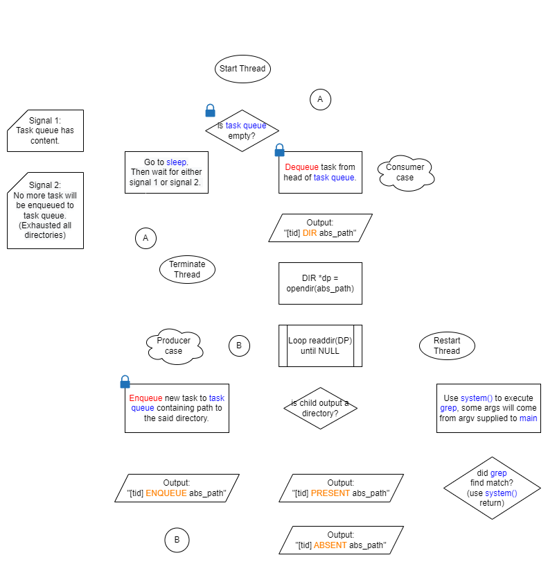

# **CS 140 Project 2: Parallelized `grep` Runner**

## **Description**
For this Operating Systems project, our goal was to **parallelize `grep`**, Linux's primary RegEx search utility.
The concurrency topics of thread synchronization primitives such as locks, condition
variables, and semaphores, critical sections in code, and thread safety and locality
are key here. For the final output, see `multithreaded.c`.
A single-threaded version is available as `single.c`.

A prudent attempt at making a multiprocessing version was also done by on-the-go study of multiprocess-safety and implementation
of interprocess communication constructs such as shared files and shared memory sections (e.g. via `mmap()`).
For the result, see `multiprocess.c`. This is almost working, the only issue was with the chain termination of sibling processes.

Main language used was C. Compilation and testing were done through Oracle VirtualBox
using CS 140's prebuilt Ubuntu appliance. Other tools used include Valgrind for catching memory leaks.

Worker thread behavior in `multithreaded.c` along with their outputs and control signals are shown in the flowchart below.

### **References**
We immediately show our references here as they contain important realizations.
- OSTEP (Ch. 29): The chapter’s threadsafe implementation of a dynamic queue served as a guide 
for my own implementation which utilizes a heap-based unbounded buffer for the task queue. 
- OSTEP  (Ch.  30):  The  chapter’s discussion  on  the  producer-consumer  bounded  buffer  problem 
served as guide for my use of locks and condition variables for thread synchronization. 
- OSTEP  (Ch.  39):  This  chapter  helped  me  understand  directory  traversal  and  the  handling  of 
absolute and relative paths. 
- https://stackoverflow.com/questions/3736320/executing-shell-script-with-system-returns-256-
what-does-that-mean : For why we should divide the return value of system() by 256. 
- https://unix.stackexchange.com/questions/119648/redirecting-to-dev-null : For how to redirect 
to /dev/null. 
- https://stackoverflow.com/questions/4553012/checking-if-a-file-is-a-directory-or-just-a-file : For 
how  to  check  if  a  “file”  is  a  regular  file  or  a  directory.  This  is  where  I  got  the  idea  of  the  isDir 
function from.

*OSTEP:* Arpaci-Dusseau, A. C. & Arpaci-Dusseau, R. H. (2018). *Operating Systems: Three Easy Steps.* University of Wisconsin-Madison. https://research.cs.wisc.edu/wind/OSTEP/

### **Quick Links**
- Full project specifications are in `extras\CS140_Project2_Specs.pdf`. Please email me for access.
- Project Documentation can be found in `extras\cs140project2.pdf`.
- Video Documentation can be found [here](https://drive.google.com/file/d/1TQsPHLUj58J7ZiazSH22b_iuG5ZbK7XZ/view?usp=share_link).

## **Requirements**
It is suggested for you to only watch the video documentation or read the written documentation.

However, if you really wish to verify the results on your end, the following would be needed.
- Windows 7 or higher. Skip the next bullet if you already have a Linux environment.
- Latest version of [WSL](https://learn.microsoft.com/en-us/windows/wsl/install) (recommended, any Distro would do). Alternative would be to set up a Linux environment in a Virtual Machine, but lightweight testing can be accomplished through WSL.
- **Important:** You must have at least 4 CPU cores in your Linux environment to proceed. 
- Upon setting-up your Linux environment, ensure that you have a `gcc` compiler. This project is untested on `clang`.
- Version 3.7 of `grep`.

For running tests, please directly proceed to the next section.

## **Running Tests**
This walkthrough will only focus on `multithreaded.c`. A test directory `testdir\` in which you could run the multithreaded `grep` is already provided for your convenience. Analagous steps can be taken for your own tests on different directories.

To make use of the provided test directory:
1. Launch `wsl` on a terminal.
2. `cd` to the root directory of this project.
3. Enter `gcc multithreaded.c -lpthread -o multithreaded`. This compiles the file as an executable named `multithreaded`. Note the POSIX multithreading tag. Other filenames could be used.
4. This  `./multithreaded 4 testdir hello`
5. Verify the results by checking the output in the terminal. As Jan Paul also taught me, it is useful to do `make qemu nox | tee test.out` to dump `stdout` to a log file, `test.out` in this case, which one can verify later on.  

Note on `priofork(k)`: this is a system call that is very similar to `fork()` but ignores the `RSDL_STARTING_LEVEL` parameter, replacing it with `k` instead. That is, a process created using `priofork(k)` will be enqueued in level `k` of the Active set. 

---
Yenzy Urson S. Hebron

University of the Philippines Diliman

1st Semester A.Y. 2022-2023

© Course Materials by Sir Wilson Tan, Sir Juan Felipe Coronel, and Ma'am Angela Zabala

---
## **xv6 Credits**
xv6 is a re-implementation of Dennis Ritchie's and Ken Thompson's Unix
Version 6 (v6).  xv6 loosely follows the structure and style of v6,
but is implemented for a modern x86-based multiprocessor using ANSI C.

ACKNOWLEDGMENTS

xv6 is inspired by John Lions's Commentary on UNIX 6th Edition (Peer
to Peer Communications; ISBN: 1-57398-013-7; 1st edition (June 14,
2000)). See also https://pdos.csail.mit.edu/6.828/, which
provides pointers to on-line resources for v6.

xv6 borrows code from the following sources:
    JOS (asm.h, elf.h, mmu.h, bootasm.S, ide.c, console.c, and others)
    Plan 9 (entryother.S, mp.h, mp.c, lapic.c)
    FreeBSD (ioapic.c)
    NetBSD (console.c)

The following people have made contributions: Russ Cox (context switching,
locking), Cliff Frey (MP), Xiao Yu (MP), Nickolai Zeldovich, and Austin
Clements.

We are also grateful for the bug reports and patches contributed by Silas
Boyd-Wickizer, Anton Burtsev, Cody Cutler, Mike CAT, Tej Chajed, eyalz800,
Nelson Elhage, Saar Ettinger, Alice Ferrazzi, Nathaniel Filardo, Peter
Froehlich, Yakir Goaron,Shivam Handa, Bryan Henry, Jim Huang, Alexander
Kapshuk, Anders Kaseorg, kehao95, Wolfgang Keller, Eddie Kohler, Austin
Liew, Imbar Marinescu, Yandong Mao, Matan Shabtay, Hitoshi Mitake, Carmi
Merimovich, Mark Morrissey, mtasm, Joel Nider, Greg Price, Ayan Shafqat,
Eldar Sehayek, Yongming Shen, Cam Tenny, tyfkda, Rafael Ubal, Warren
Toomey, Stephen Tu, Pablo Ventura, Xi Wang, Keiichi Watanabe, Nicolas
Wolovick, wxdao, Grant Wu, Jindong Zhang, Icenowy Zheng, and Zou Chang Wei.

The code in the files that constitute xv6 is
Copyright 2006-2018 Frans Kaashoek, Robert Morris, and Russ Cox.

ERROR REPORTS

We switched our focus to xv6 on RISC-V; see the mit-pdos/xv6-riscv.git
repository on github.com.

BUILDING AND RUNNING XV6

To build xv6 on an x86 ELF machine (like Linux or FreeBSD), run
"make". On non-x86 or non-ELF machines (like OS X, even on x86), you
will need to install a cross-compiler gcc suite capable of producing
x86 ELF binaries (see https://pdos.csail.mit.edu/6.828/).
Then run "make TOOLPREFIX=i386-jos-elf-". Now install the QEMU PC
simulator and run "make qemu".